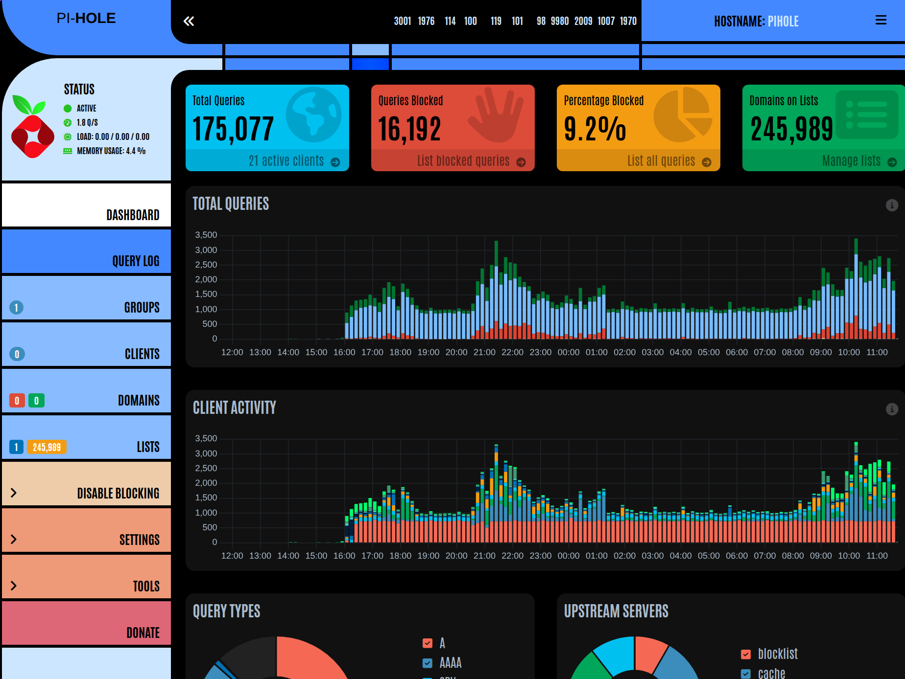

# 🤖 Death Star Pi-hole Setup

[](LICENSE)
[](https://www.gnu.org/software/bash/)
[](https://www.raspberrypi.org/)
[](https://www.python.org/)



A comprehensive, themed Raspberry Pi management system for deploying and managing Pi-hole, Grafana, Prometheus, and internet monitoring services. Features dual-environment operation with development tools for your host machine and deployment scripts for your Raspberry Pi.

## 🌟 Features

### 🖥️ Host Development Environment
- **One-click deployment** - Push scripts to Pi with `./push_to_pi.sh`
- **Interactive SSH connection** - Connect to Pi with `./connect_to_pi.sh`
- **Comprehensive validation** - Pre-deployment integrity checks with `./integrity-check.sh`
- **Rich terminal output** - Enhanced visuals with Python Rich library integration
- **Smart configuration** - Centralized JSON configuration with automatic fallbacks

### 🍓 Raspberry Pi Target Environment
- **Complete Pi-hole setup** - Ad-blocking DNS server with custom blocklists
- **Monitoring stack** - Grafana + Prometheus for system and network monitoring
- **Progress tracking** - Resumable installation process that survives reboots
- **Status monitoring** - Real-time health checks and diagnostic information
- **Easy maintenance** - Update, status check, and removal scripts

### 🛠️ Advanced Features
- **Enhanced logging** - Multi-level logging with performance tracking
- **Error resilience** - Graceful fallbacks and detailed error reporting
- **Security validation** - ShellCheck integration and permission validation
- **Modular design** - Organized library structure for maintainability

## 📁 Project Structure

```
deathstar-pi-hole-setup/
├── 🖥️  HOST ENVIRONMENT (Development Tools)
│   ├── connect_to_pi.sh      # SSH connection with failover
│   ├── push_to_pi.sh         # Deploy scripts to Pi via rsync
│   ├── integrity-check.sh    # Pre-deployment validation
│   ├── config.json           # Master configuration file
│   └── config_loader.sh      # Configuration loading system
│
└── 🍓 PI ENVIRONMENT (Target Scripts)
    ├── setup.sh              # Main installation script (resumable)
    ├── status.sh             # System status and diagnostics
    ├── update.sh             # Update all services
    ├── remove.sh             # Complete system removal
    └── lib/                  # Shared library components
        ├── config.json       # Pi-side configuration
        ├── config_loader.sh  # Configuration system
        ├── log_handler.sh    # Advanced logging system
        ├── rich_helper.py    # Enhanced terminal output
        └── rich_installer.sh # Rich library installation
```

## 🚀 Quick Start

### Prerequisites

**Host System Requirements:**
- Linux-based system (tested on Fedora 42)
- Bash 4.0+
- SSH client
- rsync
- Python 3.6+ (for enhanced output)

**Raspberry Pi Requirements:**
- Raspberry Pi OS (aarch64 recommended)
- SSH access enabled
- Internet connection

### 1. Initial Setup

Clone the repository:
```bash
git clone https://github.com/galactic-plane/deathstar-pi-hole-setup.git
cd deathstar-pi-hole-setup
```

### 2. Configure Connection

Edit `config.json` to set your Pi's IP address and user:
```json
{
  "network": {
    "pi": {
      "default_ip": "<your-pi-ip>",  # Your Pi's IP
      "default_user": ""             # Your Pi username
    }
  }
}
```

### 3. Deploy to Raspberry Pi

**Automated SSH Setup:** The push and connect scripts automatically handle SSH key setup and authentication. They will guide you through the process if keys aren't already configured, making deployment seamless and secure.

#### Simple Deployment Process
Validate and deploy in one step:
```bash
# Run integrity check first (recommended)
./integrity-check.sh

# Deploy scripts to Pi - handles SSH setup automatically
./push_to_pi.sh

# Connect to Pi for installation - uses established SSH connection
./connect_to_pi.sh
```

**What the scripts handle automatically:**
- SSH key generation and setup (if needed)
- Directory structure creation (`~/Repo/deathstar-pi-hole-setup/`)
- Secure file transfer via rsync over SSH
- Connection testing and failover mechanisms
- Interactive prompts if credentials aren't provided

**Pro Tip:** Both scripts support command-line arguments for username and IP, or they'll prompt you interactively if not provided. First-time users will be guided through the SSH key setup process automatically.

### 4. Install on Raspberry Pi

Once connected to your Pi, navigate to the project directory and run:
```bash
cd ~/Repo/deathstar-pi-hole-setup
./setup.sh
```

The installation is **resumable** - if it gets interrupted, simply run `./setup.sh` again to continue where it left off.

## 📋 Available Commands

### Host Environment Commands

| Command | Description | Usage |
|---------|-------------|-------|
| `./push_to_pi.sh` | Deploy scripts to Pi | `./push_to_pi.sh [user] [ip]` |
| `./connect_to_pi.sh` | SSH to Pi with connection testing | `./connect_to_pi.sh [user] [ip]` |
| `./integrity-check.sh` | Validate scripts before deployment | `./integrity-check.sh` |

### Pi Environment Commands

| Command | Description | Usage |
|---------|-------------|-------|
| `./setup.sh` | Install all components (resumable) | `./setup.sh` |
| `./status.sh` | Check system status and health | `./status.sh` |
| `./update.sh` | Update all installed services | `./update.sh` |
| `./remove.sh` | Remove all components | `./remove.sh` |

## 📚 Detailed Documentation

For comprehensive information about each script, including exact functionality, system requirements, and usage examples, see the detailed documentation:

### 📖 Documentation Structure

| Environment | Scripts Covered | Documentation Link |
|-------------|-----------------|-------------------|
| **🖥️ Host Environment** | Development & deployment tools | [`docs/host/README.md`](docs/host/README.md) |
| **🍓 Pi Environment** | Installation & management scripts | [`docs/pi/README.md`](docs/pi/README.md) |
| **📋 Documentation Index** | Complete overview & navigation | [`docs/README.md`](docs/README.md) |

### 🔍 What's Included

The detailed documentation provides:

- **Exact Functionality**: Step-by-step breakdown of what each script does
- **System Requirements**: Prerequisites and dependencies that scripts don't install themselves
- **Usage Examples**: Practical command examples and common scenarios
- **Configuration Options**: Available settings and customization details
- **Troubleshooting**: Common issues, solutions, and diagnostic procedures
- **Security Considerations**: SSH setup, permissions, and best practices

### 🎯 Quick Links by Use Case

| Need Help With... | Go To Documentation |
|-------------------|-------------------|
| **Setting up development environment** | [Host Scripts: push_to_pi.sh](docs/host/README.md#push_to_pish) |
| **SSH connection issues** | [Host Scripts: connect_to_pi.sh](docs/host/README.md#connect_to_pish) |
| **Pre-deployment validation** | [Host Scripts: integrity-check.sh](docs/host/README.md#integrity-checksh) |
| **Pi-hole installation process** | [Pi Scripts: setup.sh](docs/pi/README.md#setupsh) |
| **System health monitoring** | [Pi Scripts: status.sh](docs/pi/README.md#statussh) |
| **Updating services** | [Pi Scripts: update.sh](docs/pi/README.md#updatesh) |
| **Removing installation** | [Pi Scripts: remove.sh](docs/pi/README.md#removesh) |
| **Configuration management** | [Host Scripts: config_loader.sh](docs/host/README.md#config_loadersh) |

### 📊 Documentation Features

- **Complete script analysis** with exact functionality breakdowns
- **Environment-specific guidance** (host vs Pi requirements)
- **Cross-referencing** between related scripts and processes
- **Practical examples** tested with actual deployments
- **Troubleshooting integration** with specific solutions

**💡 Tip**: Start with the [Documentation Index](docs/README.md) for an overview, then dive into environment-specific guides as needed.

## 🔧 Configuration

### Master Configuration (`config.json`)

The system uses a comprehensive JSON configuration file that controls:

- **Network settings** - Pi IP, SSH configuration, connection timeouts
- **Deployment options** - File sync patterns, validation requirements
- **Display preferences** - Colors, Rich formatting, banner text
- **Security settings** - SSH options, file permissions, validation levels
- **Feature toggles** - Rich tables, auto-validation, interactive prompts

### Key Configuration Sections

```json
{
  "network": {
    "pi": {
      "default_ip": "<your-pi-ip>",
      "default_user": "",
      "ssh": {
        "connect_timeout": 5,
        "batch_mode": true
      }
    }
  },
  "deployment": {
    "rsync": {
      "options": ["-avz", "--progress"]
    },
    "validation": {
      "required_files": ["..."],
      "host_scripts": ["..."],
      "pi_scripts": ["..."]
    }
  }
}
```

## 🎨 Enhanced Terminal Output

The system features rich terminal output powered by Python's Rich library:

- **Colored output** - Error/warning/success color coding
- **Progress bars** - Visual feedback during long operations
- **Formatted tables** - Organized status and diagnostic information
- **Panels and boxes** - Enhanced visual structure
- **Automatic fallback** - Works with or without Rich library


## 🏗️ Installation Components

The setup script installs and configures:

### Core Services
- **Pi-hole** - Network-wide ad blocking DNS server
- **Unbound** - Recursive DNS resolver for enhanced privacy
- **DHCP Server** - Network management and device tracking

### Monitoring Stack
- **Grafana** - Web-based analytics and monitoring dashboards
- **Prometheus** - Time-series database and monitoring system
- **Node Exporter** - System metrics collection
- **Custom dashboards** - Pre-configured Pi-hole and system monitoring

### System Enhancements
- **Automated updates** - Cron jobs for security updates
- **Log rotation** - Automated log management
- **Backup systems** - Configuration backup and restore
- **Performance tuning** - Optimized for Raspberry Pi hardware

## 🌐 Router Configuration (Final Setup Step)

**⚠️ Important**: After completing the Pi-hole installation and verifying all services are running properly, you must configure your router to use the Pi-hole as your network's DNS server for network-wide ad blocking to take effect.

### Required Router Settings

To enable network-wide ad blocking, configure your router's DNS settings to point to your Pi-hole:

#### Primary DNS Configuration
1. **Router DNS Settings**: Set your router's DNS servers to your Pi-hole IP address
   ```
   Primary DNS: <your-pi-ip>    (Your Pi's IP address)
   Secondary DNS: <your-pi-ip>  (Your Pi's IP address - Pi-hole handles upstream DNS)
   ```

#### DHCP DNS Configuration
2. **DHCP DNS Settings**: Configure DHCP to distribute the Pi-hole IP as the DNS server to all network devices
   ```
   Primary DHCP DNS: <your-pi-ip>    (Your Pi's IP address)
   Secondary DHCP DNS: <your-pi-ip>  (Your Pi's IP address)
   ```

### Configuration Steps by Router Type

#### Most Home Routers
1. Access your router's admin panel (usually `192.168.1.1` or `192.168.0.1`)
2. Navigate to **Network Settings** → **DNS** or **Internet Settings**
3. Change **Primary DNS** to your Pi-hole IP address
4. Navigate to **DHCP Settings** or **LAN Settings**
5. Set **DHCP DNS Server** to your Pi-hole IP address
6. **Save/Apply** settings and **restart** your router

#### Advanced Router Features
- **DNS over HTTPS (DoH)**: Disable this feature if enabled, as it bypasses Pi-hole (you can setup this in pihole)
- **DNS Rebind Protection**: May need to be disabled or configured to allow Pi-hole
- **Custom DNS per device**: Some routers allow per-device DNS configuration

### Verification Steps

After configuring your router, verify the setup is working:

#### 1. Check DNS Resolution
```bash
# From any device on your network
nslookup doubleclick.net
# Should return 0.0.0.0 or similar (blocked)

nslookup google.com
# Should return actual IP address (allowed)
```

#### 2. Verify Pi-hole Usage
```bash
# On your Pi, check the query log
./status.sh
# Or access Pi-hole admin panel: http://your-pi-ip/admin
```

#### 3. Test Device Connectivity
- Browse the web from different devices
- Check that ads are blocked on websites
- Verify internet connectivity is maintained

### Important Notes

- **Backup Current Settings**: Before making changes, note your current router DNS settings
- **Pi-hole Handles Upstream**: Pi-hole manages upstream DNS servers (Cloudflare, Google, etc.) internally
- **Consistent Ad Blocking**: Using Pi-hole for both primary and secondary ensures all queries are filtered
- **Device-Specific DNS**: Some devices may have manual DNS settings that override DHCP
- **Router Restart**: Most routers require a restart for DNS changes to take effect
- **Propagation Time**: Allow 5-10 minutes for changes to propagate to all devices

### Troubleshooting Router Configuration

**If ad blocking isn't working:**
1. Verify Pi-hole is running: `./status.sh`
2. Check if devices are using Pi-hole: Pi-hole admin → Query Log
3. Confirm router DNS settings are saved and applied
4. Restart router and wait for full boot
5. Check individual device DNS settings

**If internet stops working:**
1. Verify Pi-hole services are running
2. Check Pi-hole upstream DNS servers in admin panel
3. Temporarily set router DNS back to ISP defaults
4. Ensure Pi has stable network connection

## 🔍 Monitoring and Diagnostics

### Status Monitoring

The `status.sh` script provides comprehensive system diagnostics:

```bash
./status.sh
```

**Checks include:**
- Service health (Pi-hole, Grafana, Prometheus)
- Network connectivity and DNS resolution
- System resources (CPU, memory, disk)
- Log file analysis and error detection
- Configuration validation

### Performance Monitoring

Access monitoring dashboards:
- **Grafana**: `http://your-pi-ip:3000`
- **Pi-hole Admin**: `http://your-pi-ip/admin`
- **Prometheus**: `http://your-pi-ip:9090`

## 🔒 Security Features

- **ShellCheck validation** - All scripts validated for security issues
- **Permission management** - Proper file permissions enforcement
- **SSH security** - Configurable authentication methods
- **Input validation** - Parameter validation and sanitization
- **Secure defaults** - Security-first configuration options

## 🛠️ Development and Maintenance

### Development Workflow

1. **Edit scripts** on host system
2. **Validate changes** with `./integrity-check.sh`
3. **Deploy updates** with `./push_to_pi.sh`
4. **Test remotely** via `./connect_to_pi.sh`

### Maintenance Tasks

```bash
# Update all services
./update.sh

# Check system health
./status.sh

# View logs
./status.sh --logs

# Complete removal (if needed)
./remove.sh
```

### Logging

Advanced logging system features:
- **Multiple log levels** (DEBUG, INFO, WARNING, ERROR, CRITICAL)
- **Performance timing** - Track operation durations
- **Structured logging** - JSON-compatible log format
- **Automatic rotation** - Size-based log management
- **Error context** - Detailed error information and stack traces

## 🔧 Troubleshooting

### Common Issues

**Connection Problems:**
```bash
# Test connectivity
./connect_to_pi.sh username <your-pi-ip>

# Check SSH configuration
ssh -v username@<your-pi-ip>
```

**Deployment Issues:**
```bash
# Run integrity check
./integrity-check.sh

# Verify file permissions
ls -la deathstar-pi-hole-setup/
```

**Pi-side Issues:**
```bash
# Check service status
./status.sh

# View detailed logs
journalctl -u pihole-FTL -f

# Reset and reinstall
./remove.sh
./setup.sh
```

### Log Locations

- **Setup logs**: `/var/log/deathstar-setup.log`
- **Pi-hole logs**: `/var/log/pihole.log`
- **System logs**: `journalctl -u service-name`

## 🤝 Contributing

Contributions are welcome! Please:

1. Fork the repository
2. Create a feature branch
3. Run `./integrity-check.sh` before committing
4. Submit a pull request with detailed description

### Code Standards

- All scripts must pass ShellCheck validation (No errors)
- Follow existing naming conventions
- Include comprehensive error handling
- Add logging for significant operations
- Update configuration schema as needed

## 📄 License

This project is licensed under the MIT License - see the [LICENSE](LICENSE) file for details.

## 🙏 Acknowledgments

- **Jeff Geerling** - For the [internet-pi](https://github.com/geerlingguy/internet-pi) project which is cloned and used as a core component for Pi-hole and monitoring setup
- **Pi-hole Team** - For the excellent ad-blocking solution
- **Rich Library** - For enhanced terminal output
- **Raspberry Pi Foundation** - For the amazing hardware platform
- **Open Source Community** - For the tools and inspiration

---

**May the force be with your network security! 🌟**

For support, issues, or feature requests, please visit the [GitHub repository](https://github.com/galactic-plane/deathstar-pi-hole-setup).