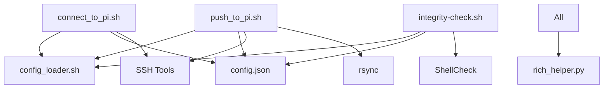

# 🖥️ Host Environment Scripts Documentation

This directory documents all scripts designed to run on your **development/host machine** for managing Death Star Pi deployments.

---

## 📋 Script Overview

| Script | Purpose | Complexity | Duration |
|--------|---------|------------|----------|
| [`push_to_pi.sh`](#push_to_pi.sh) | Deploy files to Pi via rsync | Moderate | 2-5 minutes |
| [`connect_to_pi.sh`](#connect_to_pi.sh) | SSH connection with setup | Simple | 30 seconds |
| [`integrity-check.sh`](#integrity-check.sh) | Pre-deployment validation | High | 1-3 minutes |
| [`config_loader.sh`](#config_loader.sh) | Configuration library | Library | N/A |

---

## 🚀 push_to_pi.sh

### Purpose
Primary deployment script that synchronizes local development files to your Raspberry Pi using rsync over SSH. Handles automated SSH key setup and secure file transfer.

### What It Does Exactly
1. **Configuration Loading**
   - Loads settings from `config.json` and `config_loader.sh`
   - Sets up color codes and display formatting
   - Configures rsync options and file patterns

2. **Parameter Processing**
   - Accepts command-line arguments for username and IP
   - Falls back to interactive prompts if not provided
   - Validates input format and accessibility

3. **SSH Key Management (Automated)**
   - Detects existing SSH keys (RSA, Ed25519, ECDSA)
   - Generates new SSH key pairs if none exist
   - Automatically copies public key to Pi using `ssh-copy-id`
   - Tests passwordless authentication
   - **Forces** secure key-based authentication (no passwords)

4. **Connection Testing**
   - Validates network connectivity to Pi
   - Tests SSH service availability
   - Resolves SSH host key conflicts automatically
   - Provides detailed troubleshooting on failures

5. **File Synchronization**
   - Creates remote directory structure (`~/Repo/deathstar-pi-hole-setup/`)
   - Syncs specific files using rsync with progress display
   - Excludes host-only development files
   - Validates successful transfer

6. **Post-Deploy Validation**
   - Verifies all required files transferred correctly
   - Checks file permissions on remote system
   - Provides deployment summary and next steps

### System Requirements

#### Host System (Required)
- **Operating System**: Linux-based (tested on Fedora 42)
- **Shell**: Bash 4.0 or higher
- **Network Tools**:
  - `ssh` client (OpenSSH)
  - `rsync` 3.0+ with SSH support
  - `ping` for connectivity testing
  - `ssh-keygen` for key generation
  - `ssh-copy-id` for key deployment

#### Optional Dependencies
- **Python 3.6+** with `rich` library for enhanced output
- **jq** for advanced JSON configuration parsing
- **nc` (netcat) for advanced connectivity testing

#### Network Requirements
- **Pi Accessibility**: Target Pi must be reachable on network
- **SSH Service**: Pi must have SSH server enabled (`sudo systemctl enable ssh`)
- **Firewall**: Port 22 open on Pi for SSH connections
- **User Account**: Valid user account on target Pi with sudo privileges

#### Disk Space
- **Local**: Minimal (script calculates sync size)
- **Remote**: ~50MB for all project files

### Usage Examples

```bash
# Interactive mode (prompts for all input)
./push_to_pi.sh

# With parameters
./push_to_pi.sh pi <your-pi-ip>

# First-time setup (automatic SSH key creation)
./push_to_pi.sh new-user <your-pi-ip>
```

### Configuration Files Used
- `config.json` - Master configuration
- `config_loader.sh` - Configuration loading library
- `~/.ssh/` - SSH key management

### Exit Codes
- `0` - Success: Files deployed successfully
- `1` - Error: SSH setup failed or connection issues
- `2` - Error: Rsync transfer failed
- `3` - Error: Invalid parameters or missing dependencies

---

## 🔗 connect_to_pi.sh

### Purpose
Intelligent SSH connection script that provides seamless access to your Raspberry Pi with automatic connection testing, failover mechanisms, and SSH key setup.

### What It Does Exactly
1. **Configuration Loading**
   - Loads connection settings from `config.json`
   - Sets up terminal formatting and colors
   - Configures SSH connection parameters

2. **Parameter Processing**
   - Accepts username and IP as command-line arguments
   - Prompts interactively if parameters not provided
   - Validates format and saves preferences

3. **Connection Testing & Failover**
   - Tests network connectivity with ping
   - Attempts SSH connection with multiple methods
   - Resolves SSH host key conflicts automatically
   - Handles known_hosts file updates

4. **SSH Key Management**
   - Detects if SSH keys are configured
   - Automatically sets up SSH keys if missing
   - Tests passwordless authentication
   - Forces secure key-based connections

5. **Interactive SSH Session**
   - Establishes secure SSH connection
   - Provides terminal banner with connection info
   - Maintains session until user disconnects
   - Shows connection summary on exit

### System Requirements

#### Host System (Required)
- **Operating System**: Linux-based system
- **Shell**: Bash 4.0+
- **Network Tools**:
  - `ssh` client (OpenSSH)
  - `ping` for connectivity testing
  - `ssh-keygen` for key management
  - `ssh-copy-id` for key deployment

#### Optional Dependencies
- **Python 3.6+** with `rich` library for enhanced terminal output
- **nc` (netcat) for advanced port testing

#### Network Requirements
- **Target Pi**: Must be network accessible
- **SSH Service**: Enabled on target Pi
- **Port Access**: SSH port 22 accessible
- **User Account**: Valid account on Pi with appropriate permissions

### Usage Examples

```bash
# Interactive connection (prompts for details)
./connect_to_pi.sh

# Direct connection
./connect_to_pi.sh pi <your-pi-ip>

# Connect and run specific command
./connect_to_pi.sh pi <your-pi-ip> "sudo systemctl status pihole-FTL"
```

### Features
- **Automatic Failover**: Multiple connection methods
- **Host Key Management**: Resolves SSH conflicts automatically
- **Connection Caching**: Remembers successful connections
- **Security Enforcement**: SSH keys required for connections

### Exit Codes
- `0` - Success: Connected and disconnected normally
- `1` - Error: Connection failed or SSH issues
- `2` - Error: Network connectivity problems
- `3` - Error: SSH key setup required but failed

---

## 🔍 integrity-check.sh

### Purpose
Comprehensive pre-deployment validation system that ensures all scripts, configurations, and dependencies are properly configured before transferring to the Raspberry Pi.

### What It Does Exactly
1. **Project Structure Validation**
   - Verifies all required files exist
   - Checks file permissions (executable scripts, readable configs)
   - Validates directory structure matches expected layout
   - Confirms critical files are present and accessible

2. **Script Syntax Validation**
   - **ShellCheck Integration**: Full static analysis of all shell scripts
   - Checks for syntax errors, undefined variables, and logic issues
   - Validates script dependencies and sourcing
   - Reports security vulnerabilities and best practice violations
   - Matches VS Code ShellCheck extension behavior

3. **Configuration Validation**
   - Parses and validates JSON configuration files
   - Checks for required configuration keys
   - Validates network settings and IP addresses
   - Ensures deployment paths are correctly configured

4. **Dependency Analysis**
   - Checks for required system tools (`ssh`, `rsync`, `python3`)
   - Validates optional dependencies (`rich`, `jq`, `shellcheck`)
   - Tests availability of network tools
   - Reports missing dependencies with installation guidance

5. **Security Analysis**
   - Validates file permissions for security
   - Checks for hardcoded credentials or sensitive data
   - Ensures proper SSH configuration
   - Validates deployment security settings

6. **Deployment Readiness**
   - Simulates deployment process
   - Checks target directory structure
   - Validates rsync patterns and exclusions
   - Provides deployment recommendations

### System Requirements

#### Host System (Required)
- **Operating System**: Linux-based system
- **Shell**: Bash 4.0+
- **Core Tools**:
  - `bash` with associative arrays support
  - `find` and `grep` for file analysis
  - `stat` for permission checking
  - `jq` for JSON validation

#### Optional Tools (Enhanced Features)
- **ShellCheck**: For comprehensive script analysis
  - Installation: `sudo apt install shellcheck` or `sudo dnf install ShellCheck`
  - Provides detailed syntax and security analysis
- **Python 3.6+** with `rich`: For enhanced visual output
- **nc` (netcat): For advanced network testing

#### Analysis Capabilities
- **File System**: Read access to all project files
- **Network**: Optional connectivity testing
- **Processing**: Can handle large scripts (2000+ lines)

### Validation Categories

#### 1. File Structure Checks
- Required files existence
- Directory structure validation
- File permission verification
- Executable bit validation

#### 2. Script Quality Checks
- Bash syntax validation
- Variable definition checking
- Function dependency analysis
- Error handling validation

#### 3. Security Checks
- Permission security analysis
- Hardcoded credential detection
- SSH configuration validation
- Deployment security verification

#### 4. Configuration Checks
- JSON syntax validation
- Required key presence
- Value format validation
- Cross-reference consistency

### Usage Examples

```bash
# Full integrity check
./integrity-check.sh

# Quick syntax check only
./integrity-check.sh --syntax-only

# Detailed report with recommendations
./integrity-check.sh --verbose

# Export results to file
./integrity-check.sh --output=integrity-report.txt
```

### Output Format
- **Summary Statistics**: Pass/fail counts and percentages
- **Detailed Reports**: Issue-by-issue breakdown
- **Recommendations**: Specific fixes for each issue
- **Visual Progress**: Rich terminal output with progress bars

### Exit Codes
- `0` - Success: All checks passed
- `1` - Warning: Minor issues found but deployment possible
- `2` - Error: Critical issues found, deployment not recommended
- `3` - Fatal: System requirements not met

---

## 📚 config_loader.sh

### Purpose
Shared configuration loading library that provides centralized configuration management for all Death Star Pi scripts.

### What It Does Exactly
1. **JSON Configuration Loading**
   - Parses master `config.json` file
   - Provides fallback defaults for missing values
   - Handles configuration hierarchy and inheritance
   - Supports environment-specific overrides

2. **Dynamic Variable Setting**
   - Sets global variables from configuration
   - Provides configuration accessor functions
   - Handles data type conversion (strings, numbers, booleans, arrays)
   - Manages configuration validation

3. **Environment Detection**
   - Detects host vs Pi environment
   - Loads appropriate configuration sections
   - Handles path translations between environments
   - Provides environment-specific defaults

4. **Error Handling**
   - Graceful fallback when config files missing
   - Validation of configuration values
   - Error reporting for invalid configurations
   - Safe defaults for critical settings

### System Requirements

#### Core Requirements
- **Shell**: Bash 4.0+ with associative arrays
- **Tools**: `jq` for JSON parsing (optional, has fallbacks)
- **Files**: Read access to `config.json`

#### Optional Dependencies
- **jq**: For advanced JSON parsing
- **python3**: Fallback JSON processor

### Configuration Structure

#### Network Settings
```json
{
  "network": {
    "pi": {
      "default_ip": "<your-pi-ip>",
      "default_user": "",
      "ssh": { "connect_timeout": 5 }
    }
  }
}
```

#### Deployment Settings
```json
{
  "deployment": {
    "rsync": {
      "options": ["-avz", "--progress"],
      "exclude_patterns": ["*.git*", "*.log"]
    }
  }
}
```

#### Display Settings
```json
{
  "display": {
    "colors": { "red": "\\033[0;31m" },
    "rich_formatting": { "enabled": true }
  }
}
```

### Functions Provided

#### Core Functions
- `init_config()` - Initialize configuration system
- `get_config()` - Retrieve configuration values
- `validate_config()` - Validate configuration integrity
- `reload_config()` - Reload configuration from disk

#### Environment Functions
- `detect_environment()` - Determine host vs Pi environment
- `get_env_config()` - Get environment-specific settings
- `set_env_defaults()` - Apply environment defaults

### Usage in Other Scripts

```bash
# Source the configuration loader
source "${SCRIPT_DIR}/config_loader.sh"

# Initialize with defaults
init_config "" "" ""

# Access configuration values
PI_IP=$(get_config "network.pi.default_ip")
SSH_TIMEOUT=$(get_config "network.pi.ssh.connect_timeout")
```

### Error Handling
- **Missing Files**: Provides safe defaults
- **Invalid JSON**: Falls back to hardcoded values
- **Missing Keys**: Returns default values with warnings
- **Type Conversion**: Handles string/number conversion safely

---

## 🔧 Configuration Files

### config.json
Master configuration file containing all system settings:

#### Key Sections
- **Project**: Metadata and version information
- **Network**: Pi connection and SSH settings
- **Directories**: Local and remote path configuration
- **Deployment**: Rsync options and file patterns
- **Display**: Colors and formatting preferences
- **Security**: SSH and permission settings
- **Features**: Feature toggles and capabilities

### Configuration Hierarchy
1. **Command-line arguments** (highest priority)
2. **Environment variables**
3. **config.json settings**
4. **Script defaults** (lowest priority)

---

## 🚨 Common Issues & Solutions

### SSH Connection Problems
**Issue**: "Permission denied" or "Connection refused"
**Solution**: 
1. Run `./connect_to_pi.sh` to setup SSH keys
2. Verify Pi SSH service: `sudo systemctl status ssh`
3. Check network connectivity: `ping [pi-ip]`

### File Transfer Failures
**Issue**: Rsync fails or times out
**Solution**:
1. Run `./integrity-check.sh` first
2. Verify disk space on Pi: `df -h`
3. Check network stability

### Configuration Errors
**Issue**: Scripts fail to load configuration
**Solution**:
1. Validate JSON: `jq . config.json`
2. Check file permissions: `ls -la config.json`
3. Restore from backup or regenerate

### Dependency Missing
**Issue**: "Command not found" errors
**Solution**:
1. Install required tools: `sudo apt install ssh rsync`
2. Check PATH environment variable
3. Verify tool versions meet requirements

---

## 📊 Script Dependencies



---

## 🎯 Best Practices

### Before Deployment
1. **Always run integrity check**: `./integrity-check.sh`
2. **Verify network connectivity**: Ping your Pi first
3. **Backup configurations**: Save current settings before changes

### During Development
1. **Test on staging Pi**: Don't test on production systems
2. **Version control**: Commit changes before deployment
3. **Monitor logs**: Check script output for warnings

### Security Considerations
1. **SSH keys only**: Never use password authentication
2. **Limited permissions**: Use non-root accounts when possible
3. **Regular updates**: Keep host tools updated
4. **Network security**: Use secure networks for deployment

---

For Pi-side script documentation, see [`../pi/README.md`](../pi/README.md).